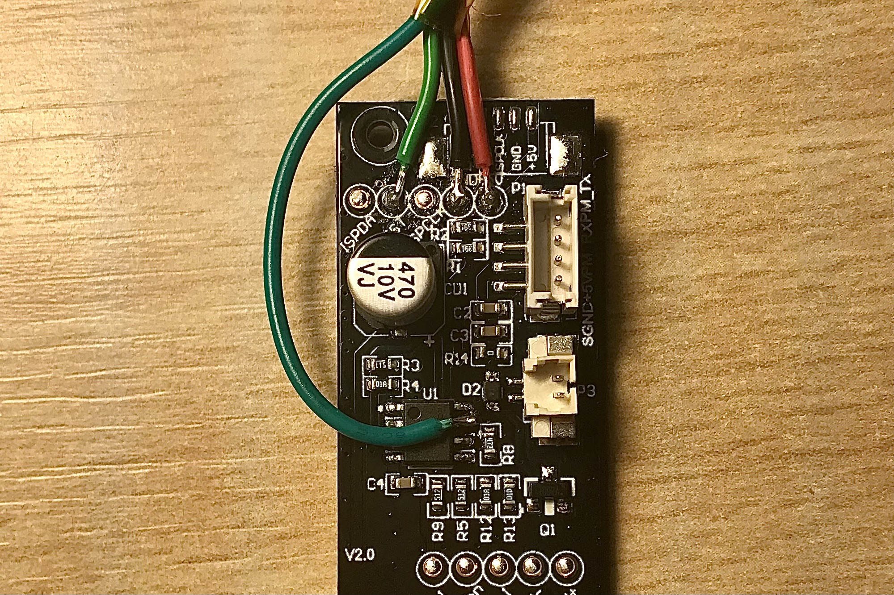

# ESP32 HomeKit Air Quality Sensor
Native Apple HomeKit via ESP32 for the IKEA VINDRIKTNING PM2.5 Air Quality sensor

[](../../actions/workflows/build.yml)

The modification doesn't interfere with the VINDRIKTNING device itself. It just reads out data and passes it to HomeKit using ESP32.

This Firmware is a Frankenstein Monster built of some other IKEA VINDRIKTNING projects from kasik96, Hypfer and ESP32 HomeKit implementation from HomeSpan.

_As usual, don't expect any warranties. I am just a hobbyist, not a professional. It works for me, but you take your own risk using it. I am not liable for any damage to your devices._

## Prerequisites

- NodeMCU ESP32 board: ESP32-WROOM or ESP32-C3-12F. More boards can be added in [platformio.ini](./platformio.ini).
- Some short cables
- A soldering iron
- A long PH0 Screwdriver

Everything we need from the IKEA sensor is accessible via easy-to-solder test points or microcontroller pins.

## Hardware
### VINDRIKTNING

To reach the original PCB from IKEA, we need to unscrew the four visible screws in the back of the enclosure.



As you can see in this image, you'll need to solder wires to GND (black), 5V (red), and the Testpoint that is connected to the TX of the
Particle Sensor (lighter green). Additionally, you need to solder the cable to one of the pins of the microcontroller (darker green) to be able to read the values from the built-in light sensor.

## Software

The firmware can be built and flashed using PlatformIO.

The web server update was implemented. You can flash binary at `http://[DEVICE IP]/update`.
There is a reboot link. Opening `http://[DEVICE IP]/reboot` will force the device to reboot.

The device can also be controlled by the button. More on [HomeSpan docs](https://github.com/HomeSpan/HomeSpan/blob/master/docs/UserGuide.md)

A list of settings variables is in the sketch. You can adjust the values up to your needs.

## Connect to HomeKit

1. Plug your Air Quality sensor to power (ESP32 is powered through VINDRIKTNING).
2. Press the button on the backside until the LED starts blinking rapidly and release it. Now it is in the configuration mode (More on [HomeSpan docs](https://github.com/HomeSpan/HomeSpan/blob/master/docs/UserGuide.md)). Press it two more times until the LED starts blinking 3 times in a row. This means mode 3 is chosen. Hold the button for 3-4 seconds once again and the WiFi AP will be started.
3. Go to WiFi settings on your iPhone/iPad and connect to the "HomeSpan-Setup" WiFi network, password `homespan`.
4. You will choose your WiFi network and set the setup code for the accessory.
5. Go to your Home app and select "Add Accessory"
6. Select "More Options" and you should see your Air Quality Sensor there.

## Prometheus metrics

The firmware creates a simple HTTP server to share the metrics to the Prometheus host server. The update interval is 10 seconds, the same as for the HomeKit data. Is available at the `http://DEVICE_IP/metrics` default port is `80`.

Installation guides for Raspberry Pi 4: [Grafana](https://pimylifeup.com/raspberry-pi-grafana/), [Prometheus](https://pimylifeup.com/raspberry-pi-prometheus/).

To add metrics to your Prometheus config:

1. Stop the Prometheus service:
```
sudo systemctl stop prometheus
```
2. Edit your config:
```
nano /home/pi/prometheus/prometheus.yml
```
Paste the following to the end of the config (Keep in mind indentation):
```
- job_name: "air_sensor"
    scrape_interval: 30s
    honor_labels: true
    static_configs:
    - targets: ['DEVICE_IP:80']
```
*Scrape interval determines, how often the server will check the device for metrics updates*

3. Start the Prometheus service again:
```
sudo systemctl start prometheus
```

## References and sources

- @kasik96 for HomeKit ESP8266 VINDRIKTNING custom firmware [GitHub link](https://github.com/kasik96/esp8266-vindriktning-particle-sensor-homekit)
- @Hypfer for MQTT ESP8266 VINDRIKTNING custom firmware [GitHub link](https://github.com/Hypfer/esp8266-vindriktning-particle-sensor)
- @HomeSpan for ESP32 HomeKit firmware [GitHub link](https://github.com/HomeSpan/HomeSpan)
- [@haxfleisch](https://twitter.com/haxfleisch) for their teardown of the device.
